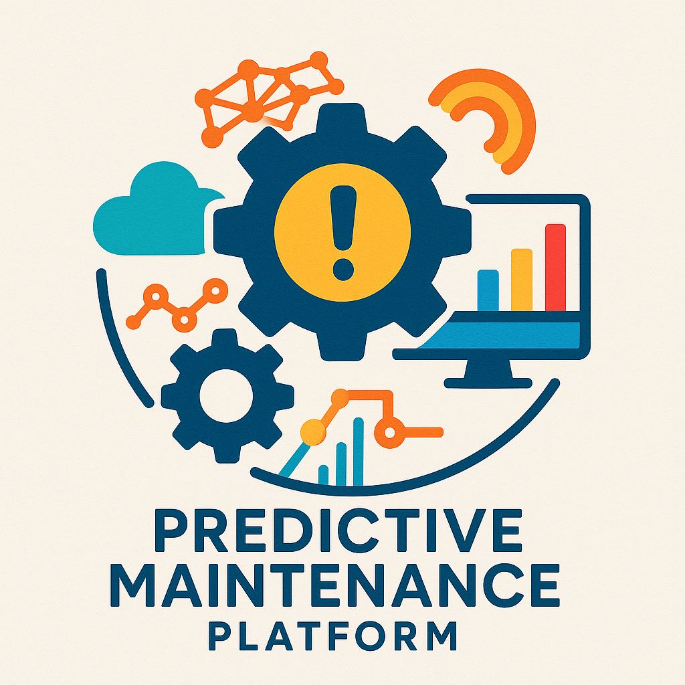

# 🌟 PHMbench: 工业装备故障预测与健康管理社区

<div align="center">
  
  <p><strong>🔬 汇聚智慧，共建PHM生态的开源社区 🔬</strong></p>
  <p><em>⚠️ 内测阶段 - 仅限邀请访问 ⚠️</em></p>

  <p>
    
    
    
  </p>
</div>

<div align="center">
  <a href="./README.md">中文文档</a> | <a href="./README_en.md">English Document</a>
</div>

## 📖 目录
- [📋 社区概览](#-社区概览)
- [🧩 社区平台矩阵](#-社区平台矩阵)
- [🔔 最新动态](#-最新动态)
- [🚀 快速导航](#-快速导航)
- [👥 加入我们](#-加入我们)
- [📂 项目结构](#-项目结构)
- [🏛️ 许可证](#️-许可证)
- [📎 引用方式](#-引用方式)

## 📋 社区概览

**PHMbench** 是一个聚焦故障预测与健康管理(Prognostics and Health Management, PHM)领域的开源社区。我们致力于连接全球PHM研究者和工程师，共同构建标准化的基准测试生态系统。我们的愿景是通过社区协作，推动PHM技术的发展与应用。

### 💡 社区愿景与价值

- 🌐 **开放协作**：构建开放、活跃的PHM研究与应用社区
- 🔍 **标准统一**：提供统一的评估标准和实验环境
- 🔄 **加速研究**：通用pipeline助力快速设计模型和算法
- 🧱 **资源聚合**：汇集高质量数据集、算法模型和工具

<!-- <div align="center">
  
  <p><em>PHMbench 社区生态系统架构</em></p>
</div> -->

## 🧩 社区平台矩阵

PHMbench社区目前开发和维护以下核心平台：

| 平台名称 | 描述 | 状态 |
|--------|------|------|
| [**PHM-Vibench**](https://github.com/PHMbench/PHM-Vibench) | 🏭 工业设备振动信号故障诊断基准平台 | 🔒 内测中 |
| [**Awesome-PHM-Paper-Agent**](./Awesome-PHM-Paper-Agent/) | 📚 PHM 领域文献智能检索与知识库 | 🛠️ 开发中 |


每个平台专注于PHM领域的不同方面，共同构成完整的PHM技术生态。

## 🔔 最新动态


- **2025.04**: 🔬 PHMbench 社区成立，Vbench平台进入内测阶段

## 🚀 快速导航

> ⚠️ **注意**: 当前项目处于内测阶段，仅向特定研究机构和合作伙伴开放。如需访问权限，请联系社区维护者。

内测参与者可通过以下链接访问各平台文档：

- **Vbench** - [📚 文档](https://github.com/PHMbench/Vbench/README.md) | [🏃‍♂️ 快速开始](https://github.com/PHMbench/Vbench/doc/quickstart.md)

- **Awesome-PHM-Paper-Agent** - [📚 文档](./Awesome-PHM-Paper-Agent/README.md) *(开发中)*


## 👥 加入我们

我们诚邀对PHM领域有兴趣的研究者和工程师加入社区！

### 📢 内测讨论组

<div align="center">
  <table>
    <tr>
      <td align="center">
        <a href="https://applink.feishu.cn/client/chat/chatter/add_by_link?link_token=d14nff5b-62b2-4857-a46b-1de87688ba72"><br>
          <strong>飞书讨论组</strong><br>
          <em>点击加入</em>
        </a>
      </td>
      <td align="center">
        <a href="https://join.slack.com/t/phmbench/shared_invite/zt-33zexd2px-uQWrrmN3pX4tSO0LtXeorA"><br>
          <strong>Slack 频道</strong><br>
          <em>点击加入</em>
        </a>
      </td>
    </tr>
  </table>
</div>

### 🤝 如何贡献

- 🐞 提交Bug报告
- 💡 提出新功能建议
- 🧪 参与测试和代码审查
- 📝 完善文档和教程
- 🔧 贡献代码和模型

## 📂 项目结构

```bash
📂 PHMbench
├── 📄 README.md                 # 社区主页说明文档
├── 📂 Vbench                    # 🏭 工业设备振动信号监测平台
├── 📂 Awesome-PHM-Paper-Agent   # 📚 PHM 文献检索与知识库
└── 📂 docs                      # 📋 社区通用文档
```

## 🏛️ 许可证

本项目采用 [Apache License (Version 2.0)](https://github.com/PHMbench/PHMbench/blob/master/LICENSE) 许可协议。各子平台可能有独立的许可说明，请参考相应文档。

## 📎 引用方式

> 📝 **注意**: 项目尚未正式发布，以下引用格式仅供内测用户参考，正式引用格式将随项目公开发布提供。

```bibtex
@misc{phmbench2023,
  title={PHMbench: A Comprehensive Community and Benchmark Ecosystem for Prognostics and Health Management},
  author={PHMbench Team},
  year={2023},
  howpublished={Internal Testing Version}
}
```

<div align="center">
  <br>
  <p>✨ 期待您的加入，共同推动 PHM 技术发展! ✨</p>
  <p>🌐 <b>PHMbench</b> - <i>汇集智慧，共创未来</i> 🌐</p>
</div>
